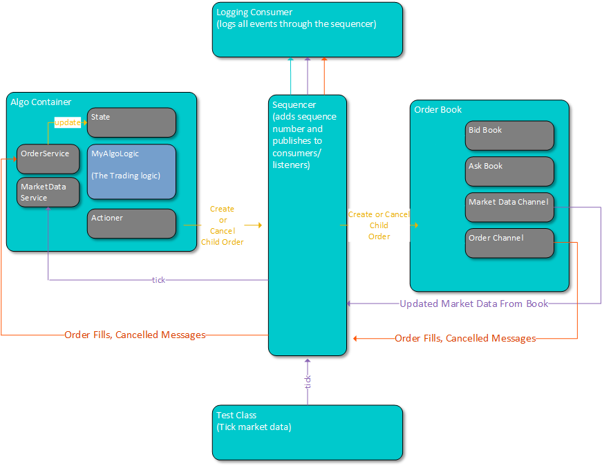

# Coding Black Females - Part 1 - Create your own Trading Algo

Welcome to your first Electronic Trading Coding Challenge!

### The Objective

The objective of this challenge is to write a simple trading algo that creates and cancels child orders. 

**Stretch objective:** write an algo that can make money buy buying shares when the order book is cheaper, and selling them when the order book is more expensive. 

##### Note
Make sure you think about how the market data could change over time, add scenarios into your test to show how you've tested those scenarios. 

### How to Get Started

#### Pre-requisites

1. The project requires Java version 17 or higher

##### Note
This project is configured for Java 17. If you have a later version installed, it will compile and run successfully, but you may see warnings in the log like this, which you can safely ignore:

```sh
[WARNING] system modules path not set in conjunction with -source 17
```

#### Opening the project

1. Fork this repo in GitHub and clone it to your local machine
2. Open the project as a Maven project in your IDE (normally by opening the top level pom.xml file)
3. Click to expand the "getting-started" module
4. Navigate to the [MyAlgoTest.java](https://github.com/cbfacademy/trading-algorithm-assessment/blob/main/algo-exercise/getting-started/src/test/java/codingblackfemales/gettingstarted/MyAlgoTest.java) and [MyAlgoLogic.java](https://github.com/cbfacademy/trading-algorithm-assessment/blob/main/algo-exercise/getting-started/src/main/java/codingblackfemales/gettingstarted/MyAlgoLogic.java)
5. You're ready to go!

##### Note
You will first need to run the Maven `install` task to make sure the binary encoders and decoders are installed and available for use. You can use the provided Maven wrapper or an installed instance of Maven, either in the command line or from the IDE integration.

To get started, run the following command from the project root: `./mvnw clean install`. Once you've done this, you can compile or test specific projects using the `--projects` flag, e.g.:

- Clean all projects: `./mvnw clean`
- Test all `algo-exercise` projects: `./mvnw test --projects algo-exercise`
- Compile the `getting-started` project only: `./mvnw compile --projects algo-exercise/getting-started`

### Writing Your Algo

At this point its worth *taking a deep breath*. There is a lot of code in this repository, but 99% of it is framework to help you. 

To get started, look at the the exampes below: 

* Algo Logic [AddCancelAlgoLogic.java](https://github.com/cbfacademy/trading-algorithm-assessment/blob/main/algo-exercise/algo/src/main/java/codingblackfemales/algo/AddCancelAlgoLogic.java) Back Test: [AddCancelAlgoBackTest.java](https://github.com/cbfacademy/trading-algorithm-assessment/blob/main/algo-exercise/backtest/src/test/java/codingblackfemales/backtest/AddCancelAlgoBackTest.java)
* Algo Logic: [PassiveAlgoLogic.java](https://github.com/cbfacademy/trading-algorithm-assessment/blob/main/algo-exercise/algo/src/main/java/codingblackfemales/algo/PassiveAlgoLogic.java) Unit Test: [PassiveAlgoTest.java](https://github.com/cbfacademy/trading-algorithm-assessment/blob/main/algo-exercise/algo/src/test/java/codingblackfemales/algo/PassiveAlgoTest.java) Back Test: [PassiveAlgoBackTest.java](https://github.com/cbfacademy/trading-algorithm-assessment/blob/main/algo-exercise/backtest/src/test/java/codingblackfemales/backtest/PassiveAlgoBackTest.java)
* Algo Logic: [SniperAlgoLogic.java](https://github.com/cbfacademy/trading-algorithm-assessment/blob/main/algo-exercise/algo/src/main/java/codingblackfemales/algo/SniperAlgoLogic.java) Back Test: [SniperAlgoBackTest.java](https://github.com/cbfacademy/trading-algorithm-assessment/blob/main/algo-exercise/backtest/src/test/java/codingblackfemales/backtest/SniperAlgoBackTest.java)

You can see from these examples the algo has access to a state object (SimpleAlgoState state), that is passed in from the container. The state object gives you access to two sets of information: 

1. A current view on the market data
2. The current view of the child orders you've created, and whether they are filled or cancelled etc..

https://github.com/cbfacademy/trading-algorithm-assessment/blob/main/algo-exercise/algo/src/main/java/codingblackfemales/algo/PassiveAlgoLogic.java#L27-L30

You can see in the above code snippet the PassiveAlgoLogic getting access to the market data on the bid side of the book. It then uses that price to place a passive order into the bid side of the order book. 

https://github.com/cbfacademy/trading-algorithm-assessment/blob/main/algo-exercise/algo/src/main/java/codingblackfemales/algo/PassiveAlgoLogic.java#L33-L36

### An Overview of the Backtesting Infra

The back testing infrastructure allows you, from within a unit test, to write an algo that adds or removes orders into an order book. When your orders go onto the order book, if they can't match immediately (i.e. the price is too passive) the order book will send a market data update showing the new order book with your quantity in it. Your algo can then see that market data update and respond to it. 

When you are writing scenarios to see how the algo would behave you can inject new market data by creating copies of the tick() method and changing the price or quantity values it submits. 

There is one example in the test provided already: 

https://github.com/cbfacademy/trading-algorithm-assessment/blob/main/algo-exercise/getting-started/src/test/java/codingblackfemales/gettingstarted/MyAlgoTest.java#L27-L33

The below diagram shows the message flows across the infrastructure. If you look at the [AbstractAlgoBackTest.java](https://github.com/cbfacademy/trading-algorithm-assessment/blob/main/algo-exercise/getting-started/src/test/java/codingblackfemales/gettingstarted/AbstractAlgoBackTest.java) you can see how this is wired together for you behind the scenes. 



In the diagram you can see your algo (MyAlgoLogic) in the darker blue box. That is where you add your logic to create or cancel orders. 

When you're orders are created they travel through a Sequencer component which duplicates the message out to each consumer. The sequencer distributes all messages  (including your createTick() message) to all consumers.

The orders then hit the order book component, the order book checks if this order can match with any other in the book (including fake orders that come from our market data tick). If it cannot immediately match, it adds the order to the order book and sends out an updated market data message showing the new quantities in the order book. The algo container will then get this updated message and see the new view of the orderbook in its state. 

If the order book can match the order immediately, it will send out a fill message and then publish a new market data message of the order book with the matched quantity removed. 

### What are the most important parts of this?

Writing tests that can assert how your algo behaves, sometimes you will get stuff or have bugs that means your code doesn't work properly, but having tests showing what you were trying to do is (almost) as good as having the whole thing work. 

### Good Luck!

Remember your mentors are here to help

### Frequently Asked Questions

1. I am getting compile errors when attempting to compile a project, how do I resolve this?

The encoders and decoders are generated from the .xsd documents in the project. To get them generated, you must run a `./mvnw install` step either from inside the IDE or from the command line. 

Please see, if you're unsure how to run maven in your setup: 
* (https://maven.apache.org/guides/getting-started/maven-in-five-minutes.html)
* (https://www.jetbrains.com/help/idea/maven-support.html)
* (https://code.visualstudio.com/docs/java/java-build#_execute-maven-commands-and-goals)
